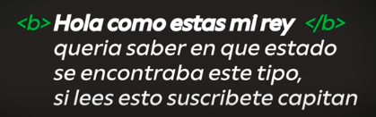

# HTML Y CSS

## HTML: Hypertext Markup Languaje (Lenguaje de marcado hipertexto)

- Lenguaje de marcado: Escribir texto y y ese texto sea interpretado por un programa y lo muestre en el formato que se desea.
- Lenguaje interpretado: Para que pueda funcionar, debe ser interpretado por otro programa. Código ejecutado en tiempo real.
- Armar la estructura de la página web.
- Cada elemento es un bloque, o algo que le da información extra al bloque.
- Todo es un elemento.
- Escribir codigo HTML -> Navegador lo interpreta -> Resultado final.
- Tags o etiquetas: Deben ser empezadas y cerradas.
- Los elementos tienen propiedades, que son sus caracteristicas. Ej: Color, sombras, borde etc.
- Las propiedades son declaradas por el ordenador con caracteristicas base.

- Atributos: Caracteristicas de las etiquetas HTML.

## CSS: Cascade Estile Sheets (Hojas de estilo en cascada)

- Le dice a todos los navegadores las propiedades estándar de los elementos.
- Nos permite modificar los elementos, cambiando y personalizando sus propiedades.
- Estructura: Selector (elementos HTML que se quiere modificar) y bloque de declaraciones (propiedades que se desean cambiar y el valor que se quiere que tengan)

## Estructur de una pagina web

- <!DOCTYPE html> especifica la version de html, tiene que estar siempre.
- "html": Todo lo que esta dentro va a ser la paguna web.
- "head": Informacion de la pagina, como el titulo. Coleccion de metadatos del documento.
- "body": Va a estar la parte visual de la web. Contenido de la pagina.
